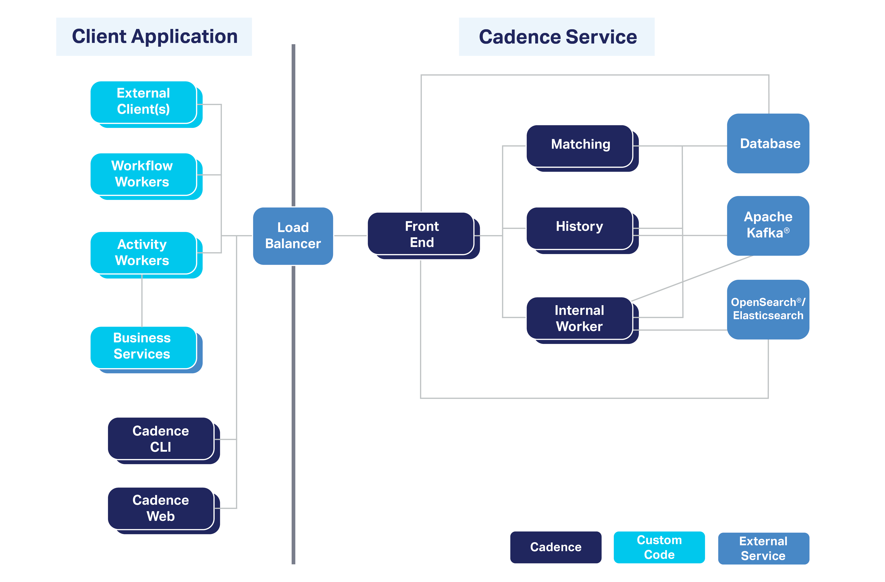
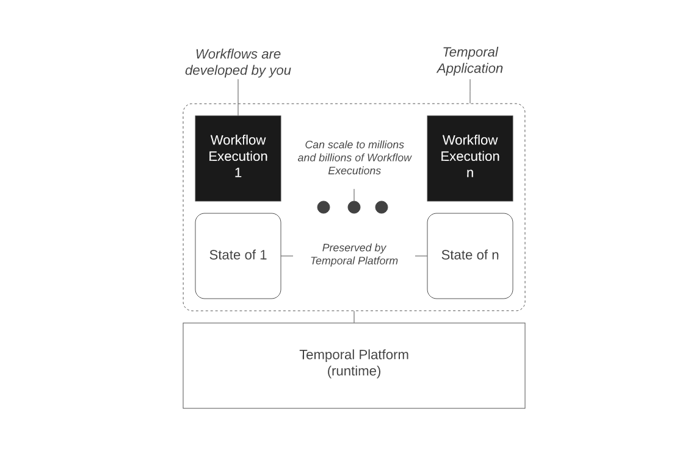
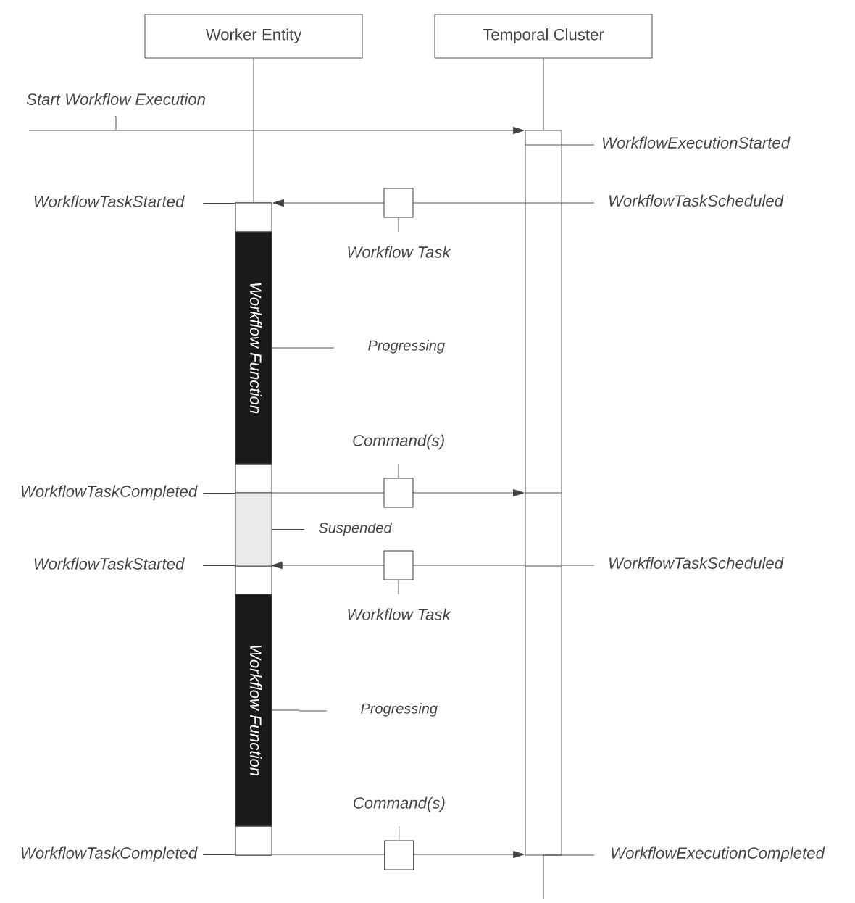
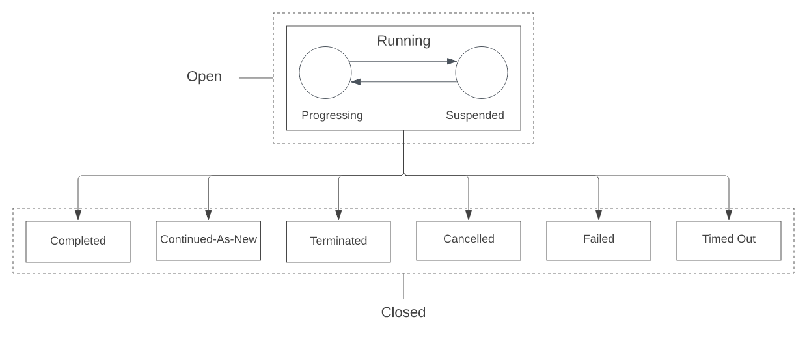
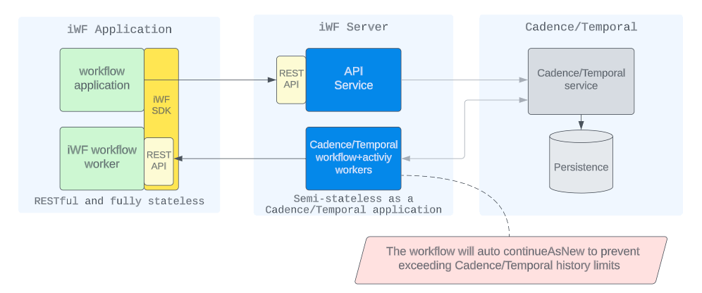
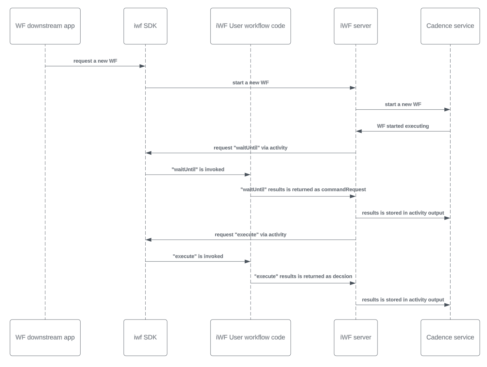
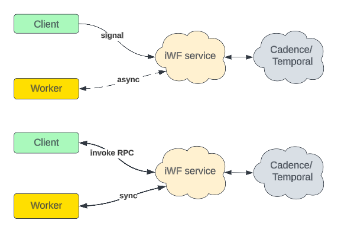

# Using iWF DSL framework to write workflow on the top of Cadence/Temporal platform

## Part 1: Cadence/Temporal Design


### What are the components of the Cadence/Temporal server?
Server consists of four independently scalable services:
- **Frontend gateway:** for rate limiting, routing, authorizing.
- **History service:** maintains data (workflow mutable state,  
  event and history storage, task queues ,and timers).
- **Matching service:** hosts Task Queues for dispatching.
- **Worker Service:** for internal background Workflows 
  (replication queue, system Workflows).
- [To learn more...](https://docs.temporal.io/clusters)

## [Basic Concepts](https://github.com/indeedeng/iwf/wiki/Basic-concepts-overview)

### Runtime platform
Provide the ecosystem to run your applications and takes care of `durability, availability, and scalability` of the application.
Both Cadence and Temporal share same behaviour as Temporal is forked from Cadence. **Worker Processes are hosted by you and execute your code.** The communication within Cluster uses `gRPC`.
Cadence/Temporal service is responsible for keeping workflow state and associated durable timers. It maintains internal queues (called task lists) which are used to dispatch tasks to external workers. Workflow execution is resumable, recoverable, and reactive.
- [Cadence Doc](https://cadenceworkflow.io/docs/get-started/)
- [Temporal Doc](https://docs.temporal.io/temporal)
- [iWF Project](https://github.com/indeedeng/iwf)


_Temporal System Overview for workflow execution_

### Workflows
The term Workflow frequently denotes either a Workflow Type, a Workflow Definition, or a Workflow Execution.
- **Workflow Definition:** A Workflow Definition is the code that defines the constraints of a Workflow Execution. A Workflow Definition is often also referred to as a Workflow Function.
- **Deterministic constraints:** A critical aspect of developing Workflow Definitions is ensuring they exhibit certain deterministic traits – that is, making sure that the same Commands are emitted in the same sequence, whenever a corresponding Workflow Function Execution (instance of the Function Definition) is re-executed.
- **Handling unreliable Worker Processes:** Workflow Function Executions are completely oblivious to the Worker Process in terms of failures or downtime.
- _Event Loop:_  
  
- _Workflow execution states:_
  


### Activities
- An Activity is a normal function or method that executes a single, well-defined action (either short or long running), such as calling another service, transcoding a media file, or sending an email message.
- Workflow code orchestrates the execution of Activities, persisting the results. If an Activity Function Execution fails, any future execution starts from initial state
- Activity Functions are executed by Worker Processes


### Event handling
Workflows can be signalled about an external event. A signal is always point to point destined to a specific workflow instance. Signals are always processed in the order in which they are received.
- Human Tasks
- Process Execution Alteration
- Synchronization  
  Example: there is a requirement that all messages for a single user are processed sequentially  
  but the underlying messaging infrastructure can deliver them in parallel. The Cadence solution  
  would be to have a workflow per user and signal it when an event is received. Then the workflow  
  would buffer all signals in an internal data structure and then call an activity for every signal received.

### Visibility
- View,  Filter and Search for Workflow Executions
  - https://docs.temporal.io/visibility#list-filter-examples
  - https://docs.temporal.io/visibility#search-attribute
- Query Workflow state

## Part 2: iWF Design
### High Level Design
An iWF application is composed of several iWF workflow workers. These workers _host REST APIs as "worker APIs" for server to call_. This callback pattern similar to AWS Step Functions invoking Lambdas, if you are familiar with.

An application also perform actions on workflow executions, such as starting, stopping, signaling, and retrieving results by calling iWF service APIs as "service APIs".

The service APIs are provided by the "API service" in iWF server. Internally, this API service communicates with the Cadence/Temporal service as its backend.



### Low Level Design
Users define their workflow code with a new SDK “iWF SDK” and the code is running in workers that talk to the iWF interpreter engine.

The user workflow code defines a list of WorkflowState and kicks off a workflow execution.

At any workflow state, the interpreter will call back the user workflow code to invoke some APIs (waitUntil or execute). Calling the waitUntil API will return some command requests. When the command requests are finished, the interpreter will then call user workflow code to invoke the “execute” API to return a decision. The decision will decide how to complete or transitioning to other workflow states.

At any API, workflow code can mutate the data/search attributes or publish to internal channels.



### RPC: Interact with workflow via API
API for application to interact with the workflow. It can access to persistence, internal channel, and state execution

[RPC vs Signal](https://github.com/indeedeng/iwf/wiki/RPC#signal-channel-vs-rpc)
  - RPC + Internal Channel = Signal Channel
  - Inter Channel and Signal Channel are both message queues
  - RPC is synchronous API call [Definition](https://github.com/indeedeng/iwf-java-sdk/blob/main/src/main/java/io/iworkflow/core/RpcDefinitions.java)
  - Signal channel is Asynchronous API call

### Determinism and Versioning: iWF Approach
- [IWF doc](https://github.com/indeedeng/iwf/wiki/Compare-with-Cadence-Temporal#determinism-and-versioning)
- Use flag to control the code execution as versioning in removed
- Since there is no versioning non-determinism issue will not happen 

### Example: Java workflow definition
```java
public class UserSignupWorkflow implements ObjectWorkflow {

    public static final String DA_FORM = "Form";

    public static final String DA_Status = "Status";
    public static final String VERIFY_CHANNEL = "Verify";

    private MyDependencyService myService;

    public UserSignupWorkflow(MyDependencyService myService) {
        this.myService = myService;
    }

    @Override
    public List<StateDef> getWorkflowStates() {
        return Arrays.asList(
                StateDef.startingState(new SubmitState(myService)),
                StateDef.nonStartingState(new VerifyState(myService))
        );
    }

    @Override
    public List<PersistenceFieldDef> getPersistenceSchema() {
        return Arrays.asList(
                DataAttributeDef.create(SignupForm.class, DA_FORM),
                DataAttributeDef.create(String.class, DA_Status)
        );
    }

    @Override
    public List<CommunicationMethodDef> getCommunicationSchema() {
        return Arrays.asList(
                InternalChannelDef.create(Void.class, VERIFY_CHANNEL)
        );
    }

    // Atomically read/write/send message in RPC
    @RPC
    public String verify(Context context, Persistence persistence, Communication communication) {
        String status = persistence.getDataAttribute(DA_Status, String.class);
        if (status.equals("verified")) {
            return "already verified";
        }
        persistence.setDataAttribute(DA_Status, "verified");
        communication.publishInternalChannel(VERIFY_CHANNEL, null);
        return "done";
    }
}
```

## Example
- [Microservice Orchestration](https://github.com/indeedeng/iwf/wiki/Use-case-study-%E2%80%90%E2%80%90-Microservice-Orchestration)
- [user signup workflow](https://github.com/indeedeng/iwf/wiki/Use-case-study-%E2%80%90%E2%80%90-user-signup-workflow)

## Setup
To run services on local machine.

### Link:
- [Dashboard](http://localhost:8233/namespaces/default/workflows)
- [iWF Project](https://github.com/indeedeng/iwf)
- [Instructions](https://github.com/indeedeng/iwf/blob/main/CONTRIBUTING.md#prepare-cadencetemporal-environment)

### Step 1: Clone Project and Run locally
- Clone the iWF project. https://github.com/indeedeng/iwf
- open cli in project folder and run: `cd docker-compose && docker-compose up`
- [Doc for temporal-admin-tools and auto-setup used in iWF Project](https://temporal.io/blog/auto-setup)
```
This by default will run Temporal server with it:
    IWF service: http://localhost:8801/
    Temporal WebUI: http://localhost:8233/
    Temporal service: localhost:7233
```

### Step 2: Registering attributes
Open CLI and execute below command if you are using temporal server. Refer instructions in links for Candence server.
```
temporal operator search-attribute create -name current_step -type Text
temporal operator search-attribute create -name aadhaarId -type Text
temporal operator search-attribute create -name aadhaar_id -type Text
temporal operator search-attribute create -name parentWorkflowId -type Text
temporal operator search-attribute create -name customer_id -type Text

temporal operator search-attribute create -name IwfWorkflowType -type Keyword
temporal operator search-attribute create -name IwfGlobalWorkflowVersion -type Int
temporal operator search-attribute create -name IwfExecutingStateIds -type Keyword
```
Handy CLI commands
```
temporal operator search-attribute list
temporal workflow list
```

### Step 3: Run the code in this repository.
```
gradle bootRun
```

### Step 4: Use the collection in postman folder to interact with Workflows
- [KYC Workflow](postman/KYC.postman_collection.json)
  - [diagram](src/main/java/dev/pravin/workflow/kyc/README.md)
- [LAMF Workflow](postman/IWF-LAMF.postman_collection.json)
  - [diagram](src/main/java/dev/pravin/workflow/lamf/README.md)
- [Order workflow](postman/IWF-order.postman_collection.json)
  - [diagram](doc/order-workflow.png)